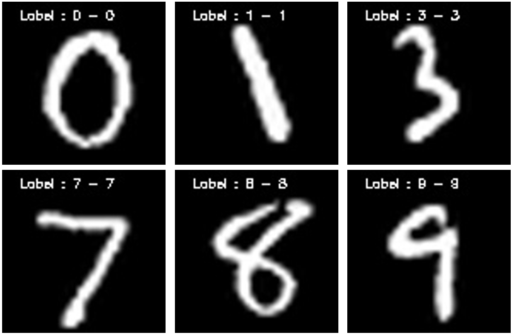

# ConvNN 
Convolutional Neural Network - LeNet

train data - MNIST train data

test data - MNIST test data

Library :: OpenCV 2.4.5 

Tool : Windows 7, Visual studio 2013





# Master Name : Seungyong Ko

--------------------------------------------------------

Image Processing and Intelligent Systems Laboratory

Chung-Ang University, Seoul 156-756, Korea

(Email) johnksy17@gmail.com (URL) http://ipis.cau.ac.kr 

(Site) https://sites.google.com/site/almightyongs/

--------------------------------------------------------


```

```
